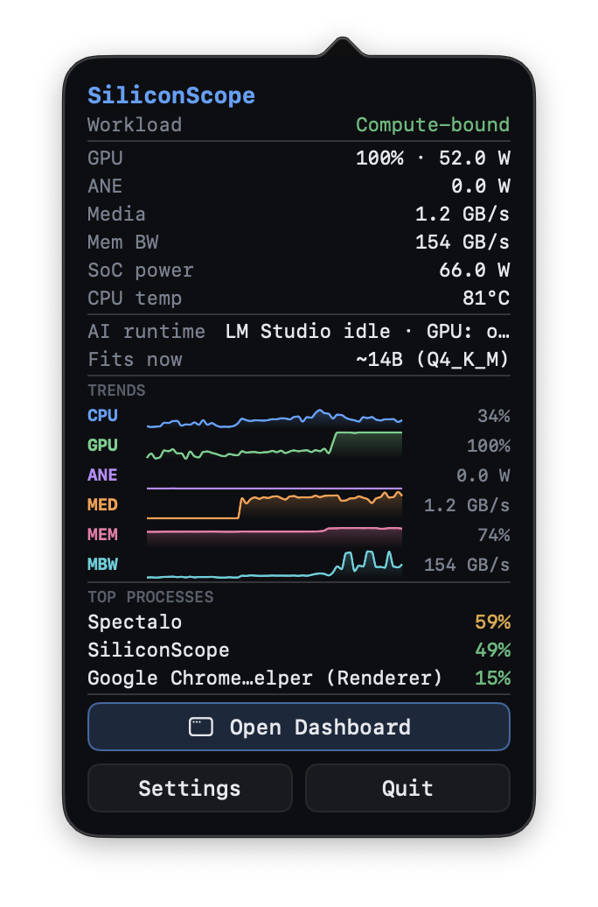
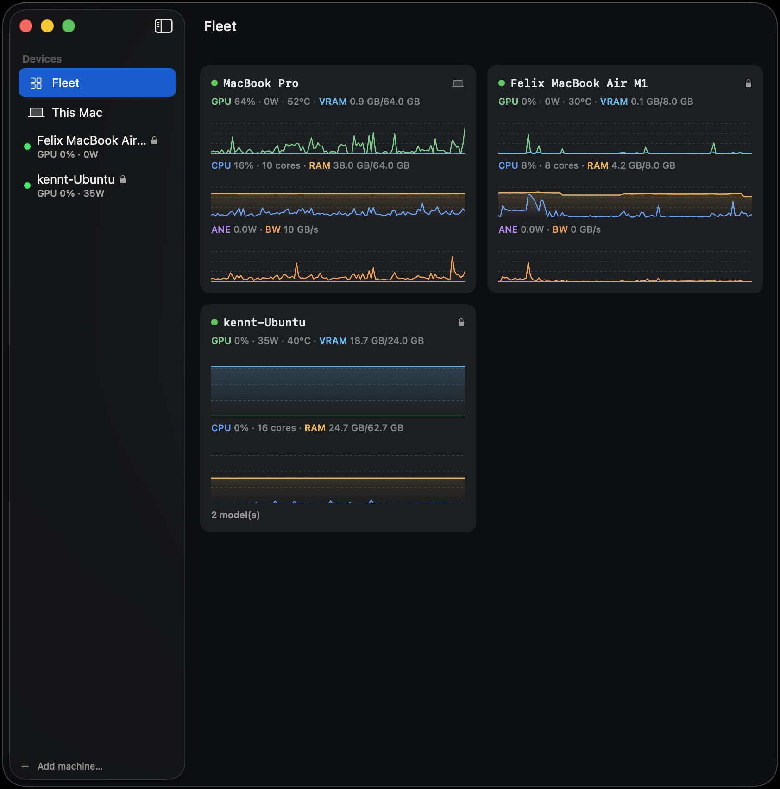
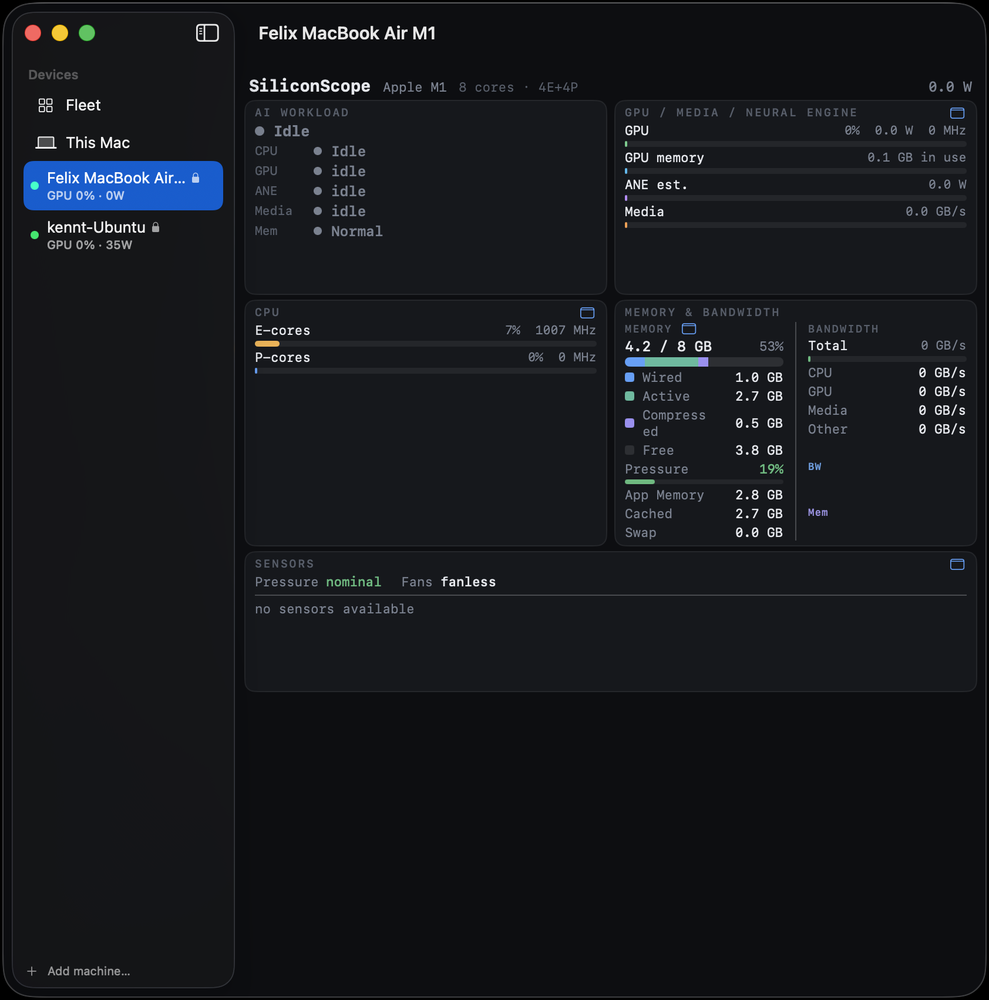
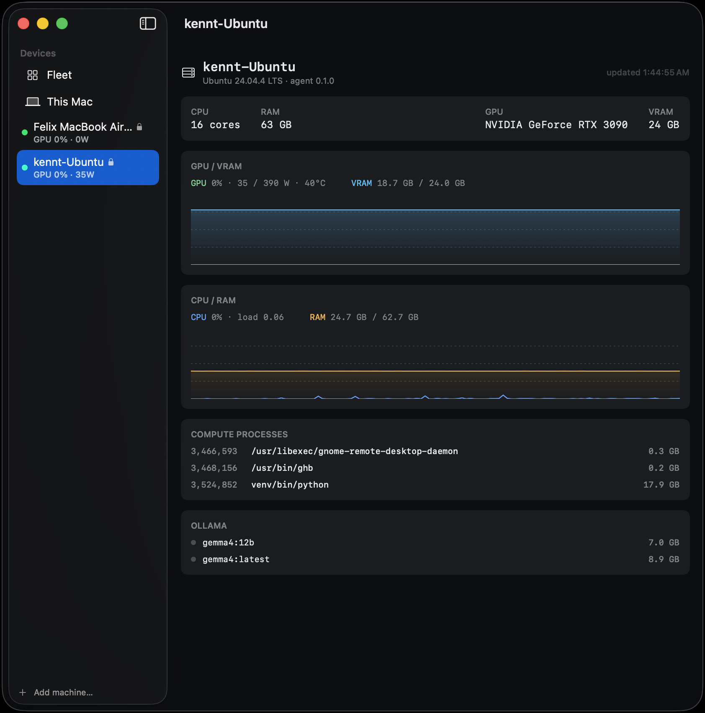
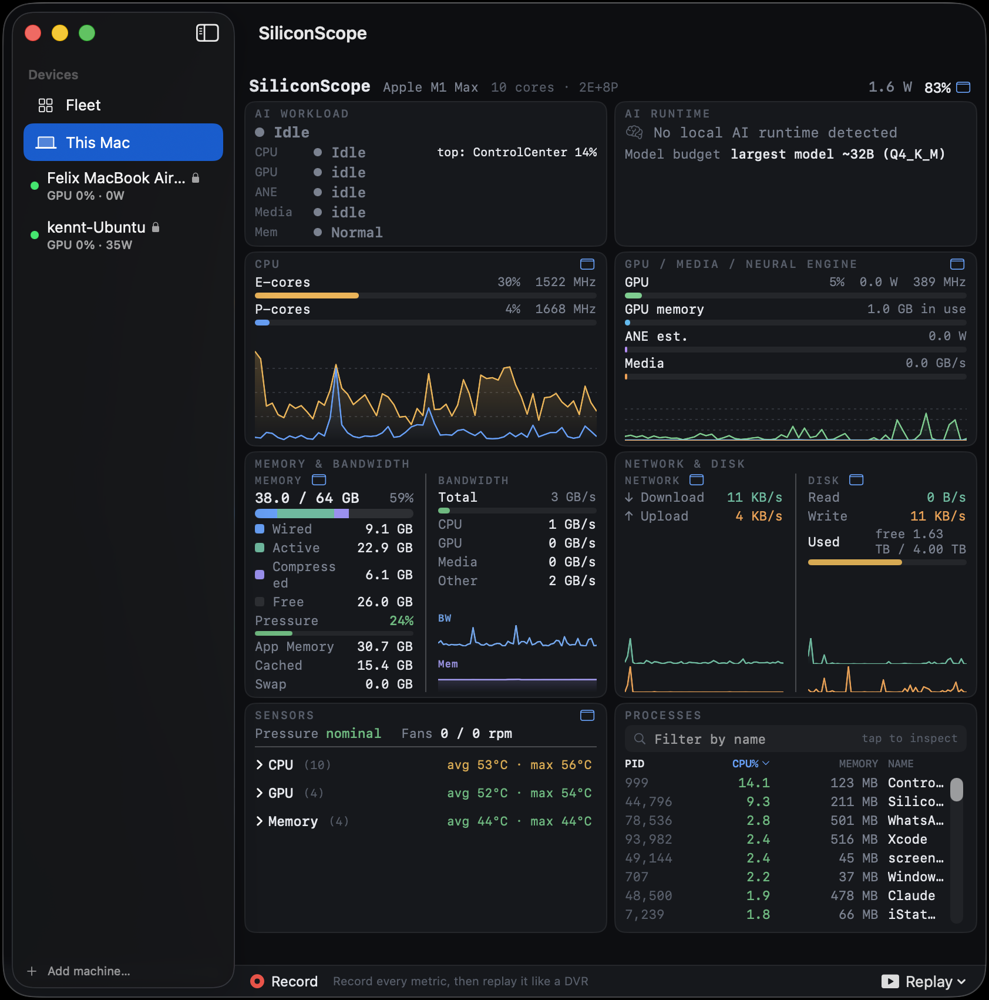
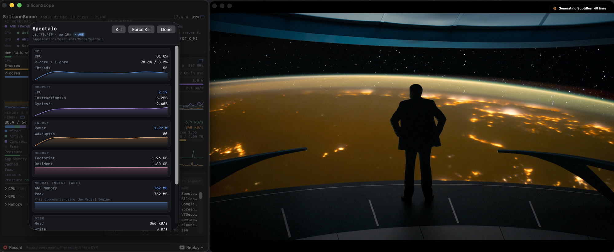
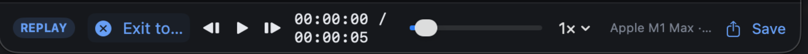

# SiliconScope

[English](README.md) · [Deutsch](README.de.md) · [简体中文](README.zh-CN.md) · [繁體中文](README.zh-TW.md) · [日本語](README.ja.md) · **한국어**

[](https://siliconscope.calidalab.ai)
[](https://github.com/kennss/SiliconScope/releases/latest)
[](https://github.com/kennss/SiliconScope/releases)
[](LICENSE)


[](https://trendshift.io/repositories/57307)

**sudo 없이 동작하는 Apple Silicon 시스템 모니터** — 네이티브 SwiftUI 대시보드 **와** 완전한
메뉴바 모음을 함께 제공하며, Activity Monitor나 터미널 모니터가 보여주지 않는 **ANE(Neural
Engine)**, **Media Engine**, **메모리 대역폭**을 일급 지표로 추적합니다.

온디바이스 AI·미디어 워크로드가 Apple Silicon 가속기를 어떻게 굴리는지 *직접 보고 싶다*는
마음에서 시작해, iStat Menus를 대체할 만한 데일리 드라이버 모니터로 자랐습니다.

**4.0 새 기능 — 이제 *다른* 기계까지 지켜봅니다.** 헤드리스 Mac mini, 책상 밑의 Linux GPU 박스,
빌려 쓰는 클라우드 인스턴스 — 거기에 작은 에이전트를 띄우면 암호화된 페어링 연결로 같은
대시보드에 합류합니다. 원격 Mac은 **Neural Engine까지 포함해** 로컬과 똑같이 표시됩니다.

*[AAPL Ch.](https://applech2.com/archives/20260620-siliconscope-apple-silicon-mac-system-monitor.html)(일본) · [ifun.de](https://www.ifun.de/siliconscope-ueberwacht-apple-ki-neural-engine-und-speicher-in-echtzeit-282222/)(독일)에 소개되었습니다.*


*머신 전체를 한눈에 — AI 워크로드 병목 분류기, E/P 코어 겹친 추세, GPU / GPU 메모리 / ANE / Media, M1 Max의 400 GB/s 한계 대비로 측정한 메모리, 코어별 온도, 전력, 그리고 실행 중인 프로세스. 아래쪽 바가 **Replay**(3.0 신규): 모든 지표가 기록되므로 DVR처럼 세션을 되감아 스크럽할 수 있습니다.*

### 메뉴바 — 모든 지표를, iStat처럼

어떤 카드든 자신만의 메뉴바 아이템으로 고정하세요 — **CPU · GPU · 메모리 · 네트워크 · SSD · 센서 · 배터리** — 각각 실시간 글리프와 풍부한 드롭다운을 가집니다. 전부 sudo 불필요.


<p align="center">
  
  
  
</p>

*정보가 가장 풍부한 드롭다운들. **GPU / Media / Neural** — GPU, GPU 메모리, ANE, Media를 실시간 막대 + 4선 60초 추세로. **센서** — 유닛별 온도, 실제 **E-Core / P-Core / GPU / Memory** 센서(칩 세대별로 큐레이션한 SMC 키, M1–M5, 그 외는 HID 폴백). **SS 콕핏** — 머신 전체를 드롭다운 하나에: 워크로드 판정, 모든 엔진, 60초 추세, 상위 프로세스.*


*온디맨드 벤치마크: "Measure tok/s"가 짧은 생성을 한 번 돌려 모델의 디코드 속도와 에너지 효율 — **tokens/sec · tokens/Wh** — 을 측정해 모델별로 저장합니다.*

> 📊 **당신의 Mac에서 tok/s를 측정했나요?** [Discussions에 올려 주세요](https://github.com/kennss/SiliconScope/discussions/5) — 칩별 크라우드소싱 표는 다른 사람의 하드웨어 선택에 도움이 됩니다.

## 4.0 새 기능

### 🛰 Fleet — 내 다른 기계들을, 같은 대시보드에서

원격 박스에 에이전트를 띄우면 **This Mac** 옆 **Devices** 사이드바에 나타납니다.
같은 LAN의 기계는 mDNS로 자동 발견되므로 IP를 설정할 필요가 없습니다.



*세 대를 한눈에. 각 타일은 **GPU + VRAM**과 **CPU + RAM**을 한 축에 겹쳐 보여주고, Apple Silicon에는
**ANE + 메모리 대역폭**이 더해집니다 — 지표 이름이 자기 선 색으로 칠해져 있어 범례가 필요 없습니다.
여기서 MacBook Pro는 **GPU 64% / 10 GB/s**, Air는 유휴, Ubuntu 박스는 **VRAM 18.7 GB**를 물고
Ollama 모델 2개를 올려둔 상태입니다. This Mac은 항상 첫 타일입니다.*

- **원격 Mac은 로컬과 완전히 동일한 대시보드로 그려집니다** — E/P 코어, GPU, **ANE**, Media,
  메모리 대역폭, 전력, 팬. 아는 한 **원격 Mac의 Neural Engine**을 보여주는 도구는 없습니다.
- **Linux/NVIDIA 박스는 GPU 중심 뷰**를 받습니다 — 사용률, VRAM, 카드 한계 대비 전력, 온도,
  VRAM을 점유 중인 프로세스, 그리고 올라와 있는 **Ollama** 모델. 3090에 E코어가 있는 척하지 않습니다.



*다른 Mac에서 들여다본 헤드리스 M1 Air: **4E+4P** 코어, GPU/Media/**ANE 추정치**, 그리고 실제 메모리
구성(**wired 1.0 / active 2.7 / compressed 0.5 GB**, 압박 19%) — 센서는 팬 값을 지어내지 않고
**fanless**라고 정직하게 보고합니다. 와이어 에이전트가 채울 수 없는 카드는 가짜로 채우는 대신 생략합니다.*



*같은 앱, 다른 기계 종류. RTX 3090 박스: 카드 한계 대비 **35 / 390 W**, **18.7 / 24 GB VRAM**,
그 VRAM을 누가 물고 있는지(Python venv가 **17.9 GB**), 그리고 디스크의 Ollama 모델. E코어도 ANE도
없습니다 — 실제로 없으니까요.*

모든 연결은 **TLS 암호화 + 토큰 인증**이며, 뷰어는 최초 연결 때 에이전트 인증서를 고정(TOFU)합니다.
그래서 키가 바뀌었거나 위장한 에이전트는 조용히 신뢰되지 않고 거부됩니다.



*Mac 한 대만 쓰는 방식은 아무것도 바뀌지 않습니다 — 같은 대시보드에 접을 수 있는 **Devices**
사이드바가 하나 붙었을 뿐입니다. 접으면 3.x와 완전히 동일합니다.*

#### 에이전트 설치

모든 플랫폼이 같은 URL — Linux는 systemd, macOS는 LaunchAgent로 설치됩니다:

```sh
curl -fsSL https://raw.githubusercontent.com/kennss/SiliconScope/main/scripts/install-agent.sh | sh
```

Mac 에이전트는 **sudo가 필요 없어서** `ssh`로 돌려도 멈추지 않고 끝까지 진행됩니다. 각 설치
스크립트는 마지막에 `sscope://pair…` 링크를 한 줄 출력합니다 — 앱의 **Add machine…**에 붙여넣으면
추가와 페어링이 한 번에 끝납니다.

직접 쓰는 Mac이라면 에이전트조차 필요 없습니다: **설정 → Share this Mac**.

> **헤드리스 Mac인가요?** 먼저 **시스템 설정 → 일반 → 공유 → 원격 로그인**을 켜세요 — 켜지 않으면
> 아무것도 설치할 수 없습니다. **LAN 밖**(Tailscale·VPN·클라우드)이라면 mDNS가 닿지 않으므로
> **Add machine…**에서 주소로 추가하세요. 포트를 공개 인터넷에 노출하기보다 Tailscale이나 SSH
> 터널을 권장합니다.

**에이전트 제거** — 해당 기계에서 설치 스크립트를 `--uninstall`로 실행하면 됩니다(`curl -fsSL …/install-agent.sh | sh -s -- --uninstall`, 또는 로컬에 있으면 `sh install-agent.sh --uninstall`). 서비스를 멈추고 바이너리·토큰·인증서·키체인을 지웁니다. 그다음 뷰어 Mac에서 Fleet 사이드바의 해당 기계를 우클릭 → **Forget pairing**.

## 3.0 새 기능

### 🧠 프로세스 인스펙터 — 프로세스별 지표를, sudo 없이

아무 프로세스나 클릭하면 인스펙터가 열립니다. Activity Monitor가 못 보여주는 것을 보여줍니다:
**CPU(P/E 분리) · IPC · 프로세스별 전력(W) · 메모리 · 디스크** — 각각 실시간 스파크라인과 함께 —
그리고 다른 어디서도 프로세스 단위로는 보여주지 않는 신호, **뉴럴 엔진 메모리**. 어느 앱이
ANE를 쓰고 있고 얼마나 잡고 있는지 한눈에 보입니다.



*온디바이스 받아쓰기 앱이 실시간 동작 중(오른쪽): CPU 65%, **IPC 2.43**, **0.64 W**, 그리고 **762 MB의
뉴럴 엔진 메모리** — 다른 모니터가 프로세스 단위로는 보여주지 않는 ANE 점유량. macOS가 시스템
전체로만 보고하는 가속기(GPU / ANE 전력 / Media / 대역폭)는 그렇게 명시합니다 — 프로세스별 수치를
지어내지 않습니다.*

### ⏺ 기록 & 재생 — 내 Mac 지표를 위한 DVR

**Record**를 누르면 SiliconScope가 모든 지표 — CPU, GPU, ANE, Media, 대역폭, 전력, 센서,
프로세스 — 를 작은 `.ssrec` 파일로 스트리밍 기록합니다. 이후 대시보드 전체를 **재생 / 일시정지 /
스크럽 / 배속** 으로 재생할 수 있어, 돌아봤을 땐 이미 사라진 스파이크도 잡아낼 수 있습니다. 모든
것은 Mac 안에 남습니다. 기록을 내보내 공유하거나 나중에 비교하세요.



*Replay 바: 재생 / 일시정지 / 한 프레임씩 이동, 타임라인 스크럽, 배속 변경, 그리고 기록 저장(Save).*

## 만들게 된 이유

온디바이스 AI 비디오 플레이어 **[Spectalo](https://spectalo.calidalab.ai/ko/)**를 개발하면서 SiliconScope를 만들었습니다. 그게 칩을
실제로 어떻게 구동하는지 보려고 모니터 두 개를 동시에 켜 놓곤 했는데, 어느 쪽도 맞지 않았어요:

- **asitop / NeoAsitop**은 칩-레벨 숫자는 있었지만 TUI가 보기 거칠고 정보가 얕았습니다.
- **btop**은 아름답고 정보 밀도가 높았지만, 정작 제가 필요한 — **ANE(Neural Engine), Media
  Engine, 메모리 대역폭** — 에는 깜깜했습니다.

둘을 나란히 켜 두는 건 번거롭고 화면 낭비였어요. NeoAsitop과 btop을 포크해 빈틈을 때우려다,
차라리 제대로 만들기로 했습니다: Apple Silicon 고유 신호를 드러내면서도 터미널 폐인이 아닌
보통 사람도 읽을 수 있는 **하나의 네이티브·보기 좋은 GUI**.

그래서 만들었습니다.

그리고 그게 존재하게 되자, 수년간 데일리 모니터였던 **iStat Menus**와 마침내 작별할 때가 됐다는
걸 깨달았습니다. **2.0**이 바로 그 지점이에요 — SiliconScope가 iStat의 자리를 대신할 만큼 완전한
메뉴바 모음, 유닛별 센서, 배터리 건강도를 갖춘 릴리즈.

## 설치

**Homebrew** — 가장 간단:

```sh
brew install --cask siliconscope
```

또는 DMG로: **[⬇ 최신 DMG 다운로드](https://github.com/kennss/SiliconScope/releases/latest)** 후:

1. 받은 `SiliconScope-*.dmg` 를 엽니다
2. **SiliconScope** 를 **응용 프로그램** 으로 드래그합니다
3. 실행합니다

Developer ID로 서명되고 **Apple 공증**을 받아 Gatekeeper 경고 없이 열립니다. **macOS 14+ ·
Apple Silicon** 필요. 이후로는 **스스로 업데이트**(Sparkle)하니, 손으로 받는 DMG는 이게
마지막입니다.

직접 빌드하고 싶다면 영어 README의 [Build & run](README.md#build--run)을 참고하세요.

## 주요 기능

- **프로세스 인스펙터** *(3.0 신규)* — 한 프로세스에 집중해 CPU(P/E 분리), IPC, 프로세스별
  **전력(W)**, 메모리, 디스크, **뉴럴 엔진 메모리**까지 — 전부 sudo 없이
- **기록 & 재생** *(3.0 신규)* — 모든 지표를 `.ssrec` 파일로 기록하고 대시보드를 **재생 /
  일시정지 / 스크럽 / 배속**으로 재생 — DVR처럼
- **AI Workload 뷰** — 병목 분류기(*bandwidth-bound* / *compute-bound* / *thermal-throttled* /
  *memory-pressured*)가 칩별 대역폭 스펙 한계에 비추어 "지금 내 로컬 LLM을 무엇이
  발목 잡는가?"에 답합니다.
- **E-코어 / P-코어 구분** — 클러스터별 사용률 + 실제 DVFS 주파수
- **GPU** — 사용률, 전력, 주파수
- **ANE & Media Engine** — Neural Engine 전력과 미디어 코덱 대역폭 (차별점)
- **메모리 대역폭** — CPU / GPU / Media / 합계 GB/s (로컬 LLM 병목 신호)
- **메모리** — Wired / Active / Compressed / Free 스택 막대 + macOS **메모리 압력** 경고
- **네트워크** ↑/↓ 와 **디스크** 읽기/쓰기 + 여유 공간, 실시간 그래프
- **유닛별 온도** — 세대별 큐레이션 SMC 키로 읽는 실제 **E-Core / P-Core / GPU / Memory**
  센서(M1–M5, 그 외는 HID 폴백), 팬 RPM, 발열 압력, **GPU 스로틀 감지**(압력 하에서 클럭이
  롤링 피크 아래로 억제되는지)
- **배터리** — 충전 상태, **건강도 %, 사이클 수, 상태**(AppleSmartBattery)
- **전력** — 도메인별 CPU / GPU / ANE / DRAM / SoC, 그리고 배터리
- **프로세스** — 정렬·필터·종료, 그리고 **클릭해서 검사** (카드 내 스크롤)
- **지표별 메뉴바 아이템** — CPU / GPU / 메모리 / 네트워크 / SSD / 센서 / 배터리를 각각 자신의
  메뉴바 글리프 + 드롭다운으로 고정(합쳐진 "SS" 콕핏 글리프도 함께)
- **자동 업데이트** — 내장 Sparkle 업데이터, 메뉴의 "Check for Updates…"
- **`sudo` 불필요.**

## 관련 프로젝트

**[Spectalo](https://spectalo.calidalab.ai/ko/)** — 온디바이스 AI 자막·번역(Whisper + Apple
Intelligence)을 갖춘 아름다운 비디오 플레이어. 같은 Calida Lab에서 만들었고, SiliconScope는 이걸
만들다가 태어났습니다. TestFlight 무료 오픈 베타 — "아무것도 기기를 벗어나지 않는다"는 같은 철학입니다.

<a href="https://spectalo.calidalab.ai/ko/"></a>

---

👉 빌드 방법, sudo 없이 동작하는 내부 원리(IOReport / SMC / HID), 그리고 엔지니어링 딥다이브는
**[영어 README](README.md)** 에 있습니다.


### Calida Lab의 다른 제품

프라이버시 우선·온디바이스 소프트웨어 (주로 Apple Silicon):

- **[SpectaLing](https://spectaling.calidalab.ai/)** — 온디바이스 전사 + 실시간 번역·동시 통역 (Mac/iPad). 프라이버시 우선 MacWhisper 대안.
- **[SpectArk](https://spectark.calidalab.ai/)** — macOS용 버전 관리 증분 백업. 파일이 바뀌는 즉시 저장.
- **[SnowChat](https://snowchat.calidalab.ai/)** — 자체 Signal 프로토콜 구현 기반 종단간 암호화 메신저.
- **[SnowClaw](https://snowclaw.calidalab.ai/)** — 프라이버시 보존 에이전틱 AI 레퍼런스 아키텍처 (워킹 페이퍼).

**→ [www.calidalab.ai](https://www.calidalab.ai/ko/)** · [@kennss](https://github.com/kennss)


번역 개선 제안은 언제든 환영합니다 — PR 주세요.
