# SiliconScope

[English](README.md) · [Deutsch](README.de.md) · [简体中文](README.zh-CN.md) · [繁體中文](README.zh-TW.md) · [日本語](README.ja.md) · **한국어**

[](https://siliconscope.calidalab.ai)
[](https://github.com/kennss/SiliconScope/releases/latest)
[](https://github.com/kennss/SiliconScope/releases)
[](LICENSE)


[](https://trendshift.io/repositories/57307)

**sudo 없이 돌아가는 Apple Silicon 시스템 모니터**입니다. 네이티브 SwiftUI 대시보드와 메뉴바
아이템 한 벌로 구성되며, Activity Monitor나 터미널 모니터에서는 볼 수 없는 **ANE(Neural Engine)**,
**Media Engine**, **메모리 대역폭**을 제대로 보여 주는 것이 핵심입니다.

온디바이스 AI와 미디어 작업이 Apple Silicon의 가속기를 실제로 어떻게 쓰는지 *눈으로 보고 싶어서*
시작했고, 지금은 iStat Menus 대신 매일 켜 두고 쓰는 모니터가 됐습니다.

**4.0부터는 다른 기계도 같이 봅니다.** 헤드리스 Mac mini, 책상 밑 Linux GPU 박스, 빌려 쓰는
클라우드 인스턴스에 작은 에이전트를 하나 띄우면, 암호화된 페어링 연결로 같은 대시보드에 들어옵니다.
원격 Mac도 **Neural Engine까지** 로컬 Mac과 똑같이 보입니다.

*[OWC Rocket Yard](https://eshop.macsales.com/blog/99094-siliconscope-improves-upon-macos-activity-monitor-with-apple-silicon-insights/)(미국), [AAPL Ch.](https://applech2.com/archives/20260620-siliconscope-apple-silicon-mac-system-monitor.html)(일본), [ifun.de](https://www.ifun.de/siliconscope-ueberwacht-apple-ki-neural-engine-und-speicher-in-echtzeit-282222/)(독일)에 소개됐습니다.*

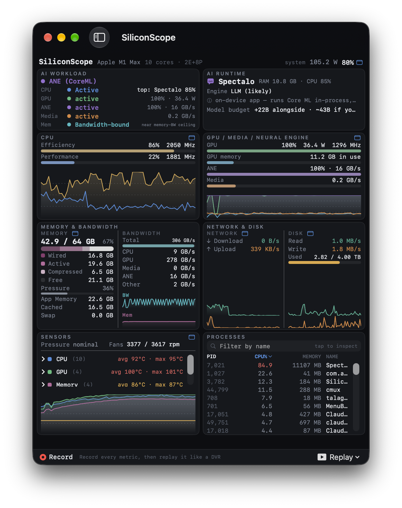

*macOS 27이 설치된 M1 Max에서 [Spectalo](https://spectalo.calidalab.ai/)가 Core ML 모델을 돌리고 있는 화면입니다. 워크로드 분류기는 **ANE (CoreML)**로 판정했고, Neural Engine은 **100 % 활성 상태로 16 GB/s**를 주고받고 있습니다. 이 값은 클러스터 residency를 직접 잰 것이라, 이 칩의 에너지 카운터가 30분에 한 번 정도만 갱신되는 macOS 27에서도 실시간으로 움직입니다. GPU는 100 %에 36 W, 메모리 대역폭은 칩 한계 400 GB/s 중 306 GB/s를 쓰고 있어 **대역폭 병목**으로 표시됩니다. 헤더의 **system 105 W**는 Mac 전체가 쓰는 전력입니다. 색은 눈여겨볼 곳에만 씁니다. 이 화면에서는 90 °C를 넘은 CPU·GPU 온도만 빨간색이고 나머지는 무채색입니다. 맨 아래 막대는 **Replay**(3.0에서 추가)입니다. 모든 지표가 기록되니, 지나간 순간도 DVR처럼 되감아 볼 수 있습니다.*

### 메뉴바 — iStat처럼, 지표마다 하나씩

카드마다 메뉴바 아이템으로 따로 띄울 수 있습니다. **CPU · GPU · 메모리 · 네트워크 · SSD · 센서 · 배터리**가 각자 실시간 아이콘과 드롭다운을 갖습니다. 아이템마다 **표시 방식**(막대 · 기록 그래프 · 두 줄 · 숫자 하나 · 아이콘)과 보여 줄 값을 따로 고를 수 있어서, 같은 지표를 두 번 띄워도 됩니다. CPU를 막대로 하나, 그래프로 하나 띄우는 식입니다. 어느 것도 sudo가 필요 없습니다.

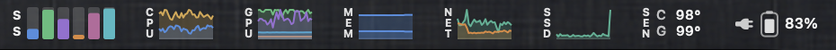

<p align="center">
  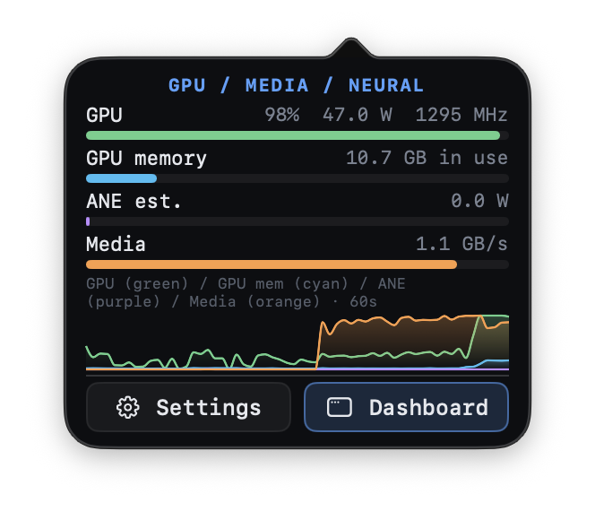
  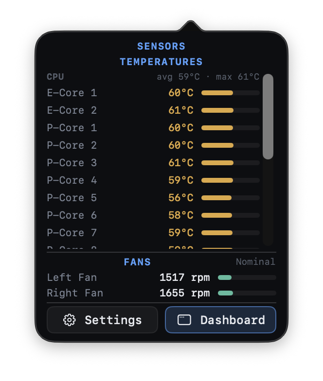
  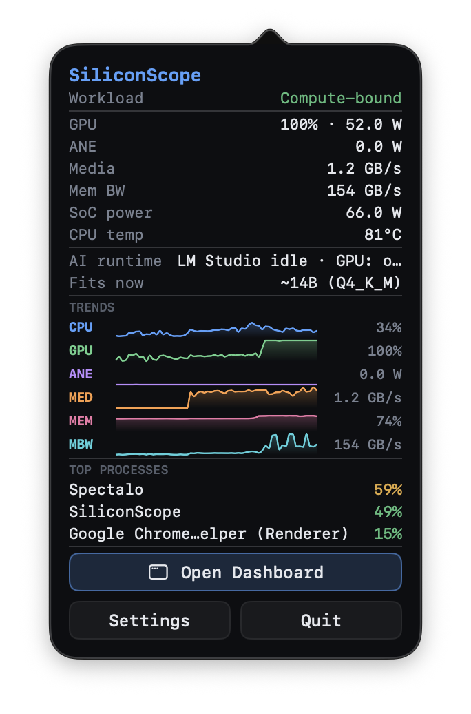
</p>

*내용이 가장 많은 드롭다운 세 가지입니다. **GPU / Media / Neural**은 GPU, GPU 메모리, ANE, Media를 실시간 막대와 60초 추세선 네 개로 보여 줍니다. **센서**는 실제 **E-Core / P-Core / GPU / Memory** 센서에서 읽은 부위별 온도입니다(M1–M5는 칩 세대별로 골라 둔 SMC 키, 그 밖의 칩은 HID). **SS 콕핏**은 Mac 전체를 드롭다운 하나에 담았습니다. 워크로드 판정, 모든 엔진, 60초 추세, 상위 프로세스가 한곳에 있습니다.*

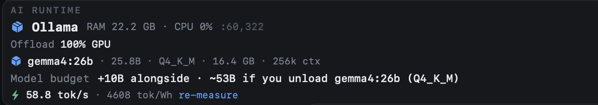

*필요할 때 돌리는 벤치마크입니다. "Measure tok/s"를 누르면 짧은 생성을 한 번 실행해 모델의 디코드 속도와 전력 효율, 즉 **tokens/sec · tokens/Wh**를 재고 모델별로 저장합니다.*

> 📊 **내 Mac에서 잰 tok/s가 있다면** [Discussions에 올려 주세요](https://github.com/kennss/SiliconScope/discussions/5). 칩별 결과가 모이면 다른 사람이 하드웨어를 고를 때 참고가 됩니다.

## 4.0에서 달라진 점

### 🛰 Fleet — 다른 기계도 같은 대시보드에서

원격 기계에 에이전트를 띄우면 **This Mac** 옆 **Devices** 사이드바에 나타납니다.
같은 LAN에 있는 기계는 mDNS로 알아서 찾기 때문에 IP를 입력할 필요가 없습니다.

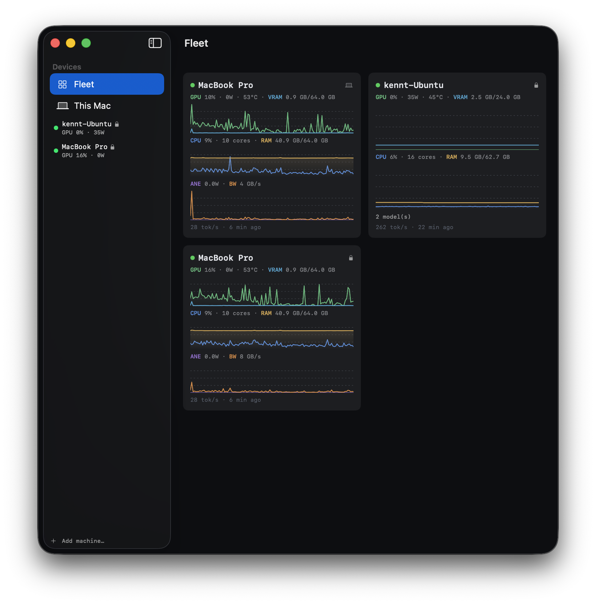

*세 대를 한 화면에 모았습니다. 타일마다 **GPU + VRAM**과 **CPU + RAM**을 한 그래프에 겹쳐 그리고,
Apple Silicon에는 **ANE + 메모리 대역폭** 그래프가 하나 더 붙습니다. 지표 이름이 선과 같은 색이라
범례는 따로 없습니다. 타일 맨 아랫줄은 **런타임이 직접 잰 생성 속도**와 그 값이 언제 것인지입니다.
Ubuntu 박스는 **262 tok/s**, 두 Mac은 **28 tok/s**가 나왔습니다. 시간이 지나 지금 상태와 맞지 않게
된 값은 흐리게 표시합니다. This Mac은 항상 첫 번째 타일입니다.*

- **원격 Mac은 로컬 Mac과 똑같은 대시보드로 보입니다.** E/P 코어, GPU, **ANE**, Media,
  메모리 대역폭, 전력, 팬까지 다 나옵니다. 제가 아는 한 **원격 Mac의 Neural Engine**을 보여 주는
  도구는 이것 말고 없습니다.
- **Linux/NVIDIA 박스는 GPU 위주 화면**으로 보입니다. 사용률, VRAM, 카드 한계 대비 전력, 온도,
  VRAM을 잡고 있는 프로세스, 올라와 있는 **Ollama** 모델이 나옵니다. 3090에 없는 E코어를 있는
  것처럼 그리지는 않습니다.

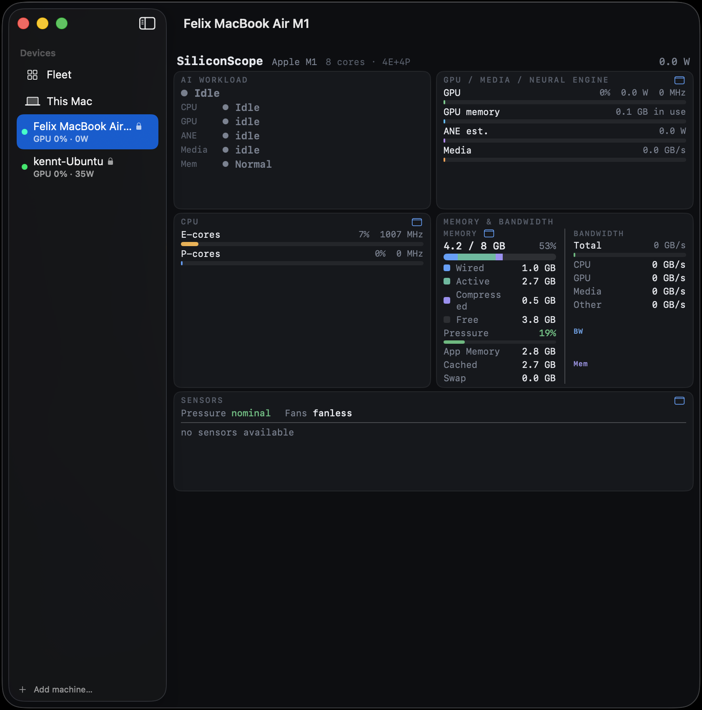

*다른 Mac에서 본 헤드리스 M1 Air입니다. **4E+4P** 코어, GPU/Media/**ANE 추정치**, 그리고 실제 메모리
구성(**wired 1.0 / active 2.7 / compressed 0.5 GB**, 메모리 압력 19%)이 보입니다. 팬이 없는 기계라
센서 카드는 팬 값을 지어내지 않고 **fanless**라고 표시합니다. 에이전트가 보내 주지 못하는 카드는
빈 값을 꾸며 넣지 않고 아예 뺍니다.*

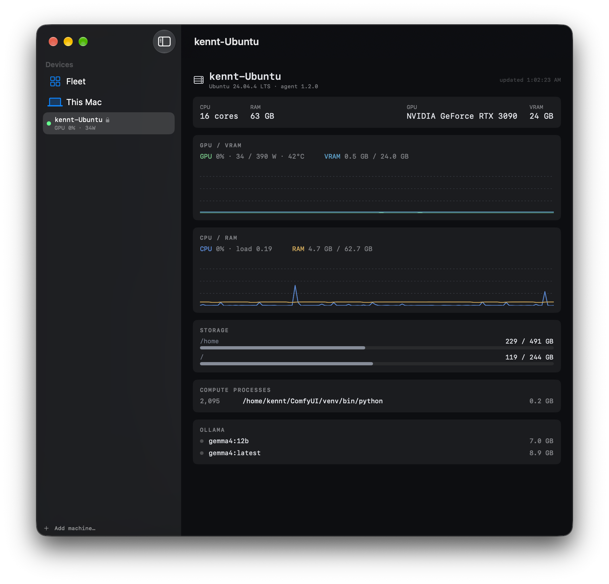

*같은 앱으로 본 전혀 다른 종류의 기계입니다. 쉬고 있는 RTX 3090 박스가 카드 한계 390 W 중
**34 W**를 쓰고, VRAM은 **24 GB 중 0.5 GB**를 ComfyUI의 Python(**0.2 GB**) 등이 잡고 있습니다.
드라이브 두 개의 용량(4.4에서 추가)과 디스크에 있는 Ollama 모델도 보이는데, 올라간 모델이 없어서
회색입니다. E코어도 ANE도 없습니다. 이 기계에는 원래 없으니까요.*

모든 연결은 **TLS로 암호화되고 토큰으로 인증**합니다. 뷰어는 처음 연결할 때 에이전트 인증서를
기억해 두기 때문에(TOFU), 키가 바뀌었거나 다른 기계가 흉내 내는 에이전트는 몰래 믿지 않고 거부합니다.

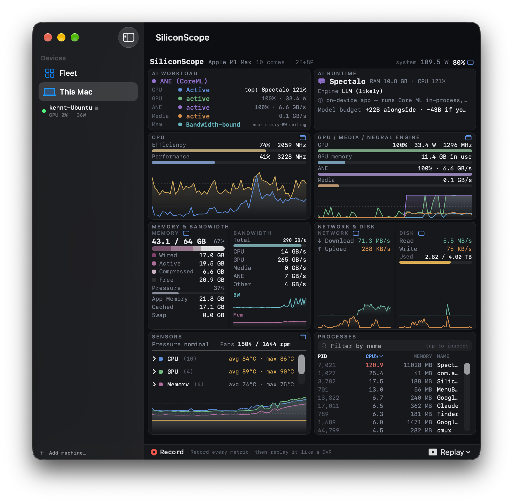

*Mac 한 대만 쓴다면 달라지는 건 없습니다. 같은 대시보드에 접을 수 있는 **Devices** 사이드바가
생겼을 뿐이고, 접으면 3.x와 똑같습니다.*

#### 에이전트 설치

플랫폼과 상관없이 URL은 하나입니다. Linux에는 systemd 서비스로, macOS에는 LaunchAgent로 설치됩니다.

```sh
curl -fsSL https://raw.githubusercontent.com/kennss/SiliconScope/main/scripts/install-agent.sh | sh
```

Mac 에이전트는 **sudo가 필요 없어서** `ssh`로 실행해도 중간에 멈추지 않고 끝까지 설치됩니다.
설치가 끝나면 `sscope://pair…` 링크가 한 줄 출력됩니다. 앱의 **Add machine…**에 붙여 넣으면 기계
추가와 페어링이 한 번에 끝납니다.

앞에 앉아서 직접 쓰는 Mac이라면 에이전트를 깔 필요도 없습니다. **설정 → Share this Mac**을 켜면 됩니다.

**Intel Mac**에서는 에이전트가 CPU와 메모리를 보냅니다. 그 기계에 있는 게 그것뿐이기 때문입니다.
칩 수준 지표가 빠지는 건 해당 하드웨어가 없어서입니다. Neural Engine도 Media Engine도 없고, 통합
메모리 대역폭과 도메인별 전력은 Apple Silicon만 제공하는 인터페이스에서 나옵니다. 앱 자체는 여전히
Apple Silicon 전용입니다.

**Windows**에서는 에이전트가 CPU와 메모리를 보내고, NVIDIA 카드는 Linux와 같은 `nvidia-smi`로
사용률·VRAM·온도·전력·프로세스별 VRAM을 읽습니다. Windows에는 load average가 없어서 그 칸은 없는
숫자를 만들어 넣지 않고 비워 둡니다. 드라이브 용량은 아직 수집하지 않습니다. Fleet에는 Linux GPU
박스와 같은 방식으로 들어옵니다. 한 줄 설치 스크립트는 아직 없으니,
`GOOS=windows go build ./agent` 로 에이전트를 빌드해 예약된 작업으로 실행하세요.

> **헤드리스 Mac이라면** 먼저 **시스템 설정 → 일반 → 공유 → 원격 로그인**을 켜세요. 이게 꺼져 있으면
> 아무것도 설치할 수 없습니다. **LAN 밖**(Tailscale, VPN, 클라우드)에 있는 기계는 mDNS로 찾을 수
> 없으니 **Add machine…**에서 주소로 추가하세요. 포트를 인터넷에 그대로 열기보다는 Tailscale이나
> SSH 터널을 쓰는 편이 안전합니다.

**에이전트를 지우려면** 그 기계에서 같은 설치 스크립트를 `--uninstall`과 함께 실행합니다.

```sh
curl -fsSL https://raw.githubusercontent.com/kennss/SiliconScope/main/scripts/install-agent.sh | sh -s -- --uninstall
```

서비스를 멈추고 바이너리, 토큰, 인증서, 키체인을 지웁니다. 그다음 뷰어 Mac의 Fleet 사이드바에서 그 기계를 우클릭해 **Forget pairing**을 누르세요.

## 3.0에서 달라진 점

### 🧠 프로세스 인스펙터 — 프로세스별 지표를 sudo 없이

프로세스를 클릭하면 인스펙터가 열리고, Activity Monitor에는 없는 정보가 나옵니다.
**CPU(P/E 구분) · IPC · 프로세스별 전력(W) · 메모리 · 디스크**를 각각 실시간 그래프로 보여 주고,
다른 도구는 프로세스 단위로 보여 주지 않는 **Neural Engine 메모리**도 나옵니다. 어떤 앱이 ANE를
쓰고 있는지, 얼마나 잡고 있는지 바로 알 수 있습니다.

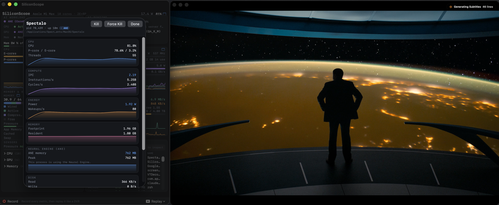

*오른쪽은 온디바이스 받아쓰기 앱이 한창 돌고 있는 모습입니다. CPU 65%, **IPC 2.43**, **0.64 W**,
그리고 **Neural Engine 메모리 762 MB**. 이 ANE 사용량은 다른 모니터에서는 프로세스 단위로 볼 수
없습니다. macOS가 시스템 전체 값만 주는 가속기(GPU / ANE 전력 / Media / 대역폭)는 그렇다고
밝혀 두고, 프로세스별 숫자를 만들어 내지 않습니다.*

### ⏺ 기록과 재생 — Mac 지표를 위한 DVR

**Record**를 누르면 CPU, GPU, ANE, Media, 대역폭, 전력, 센서, 프로세스까지 모든 지표를 작은
`.ssrec` 파일에 계속 기록합니다. 나중에 대시보드 전체를 **재생 / 일시정지 / 스크럽 / 배속**으로
다시 볼 수 있어서, 보고 있지 않을 때 지나간 급등도 놓치지 않습니다. 기록은 전부 Mac 안에만
남습니다. 내보내서 공유하거나 나중에 비교할 때 쓰면 됩니다.

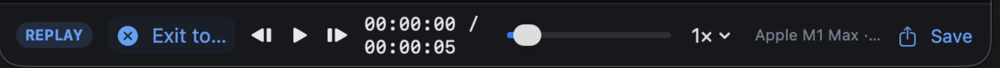

*Replay 막대: 재생 / 일시정지 / 한 프레임씩 이동, 타임라인 스크럽, 배속 조절, 기록 저장(Save).*

## 만든 이유

온디바이스 AI 비디오 플레이어 **[Spectalo](https://spectalo.calidalab.ai/ko/)**를 만들다가 SiliconScope가 나왔습니다. Spectalo가 칩을
실제로 어떻게 쓰는지 보려고 모니터 두 개를 나란히 켜 두곤 했는데, 둘 다 아쉬웠습니다.

- **asitop / NeoAsitop**은 칩 수준 숫자는 보여 줬지만, TUI가 투박하고 담긴 정보가 적었습니다.
- **btop**은 보기 좋고 정보도 빽빽했지만, 정작 제게 필요한 **ANE(Neural Engine), Media
  Engine, 메모리 대역폭**은 보여 주지 않았습니다.

둘을 같이 켜 두자니 번거롭고 화면만 차지했습니다. NeoAsitop이나 btop을 포크해 부족한 부분을
메워 볼까 하다가, 처음부터 제대로 만들기로 했습니다. Apple Silicon만의 신호를 보여 주면서도
터미널에 익숙하지 않은 사람도 읽을 수 있는, **보기 좋은 네이티브 GUI 하나**를요.

그렇게 만들었습니다.

만들고 나니 몇 년 동안 매일 쓰던 **iStat Menus**를 이제 내려놓아도 되겠다 싶었습니다. **2.0**이
그 시점입니다. 메뉴바 아이템 한 벌, 부위별 센서, 배터리 상태까지 갖춰서 SiliconScope만으로
iStat 자리를 채울 수 있게 된 버전입니다.

## 설치

**Homebrew**가 가장 간단합니다.

```sh
brew install --cask siliconscope
```

DMG로 설치하려면 **[⬇ 최신 DMG 다운로드](https://github.com/kennss/SiliconScope/releases/latest)** 후:

1. 받은 `SiliconScope-*.dmg` 를 엽니다
2. **SiliconScope** 를 **응용 프로그램** 폴더로 끌어다 놓습니다
3. 실행합니다

Developer ID로 서명하고 **Apple 공증**을 받았기 때문에 Gatekeeper 경고 없이 열립니다. **macOS 14 이상,
Apple Silicon**이 필요합니다. 이후 업데이트는 앱이 **알아서 받으니**(Sparkle), DMG를 직접 받는 건
이번이 마지막입니다.

> **정식 출시 전 macOS(베타)는 지원하지 않습니다.** 이 프로젝트에는 Mac이 한 대뿐이고 정식 버전을
> 쓰고 있어서, 개발자 베타에서 생긴 문제는 여기서 재현하거나 확인할 수 없습니다. 그래도 제보는 반갑고
> 실제로 도움도 됐습니다. SiliconScope는 Apple이 빌드마다 이름을 바꾸는 비공개 IOReport 인터페이스를
> 읽기 때문에, 이름이 바뀐 걸 일찍 알면 모두에게 퍼지기 전에 고칠 수 있습니다. 다만 수정은 베타
> 시드가 아니라 정식 출시에 맞춰 나갑니다.

직접 빌드하려면 영어 README의 [Build & run](README.md#build--run)을 보세요.

## 주요 기능

- **프로세스 인스펙터** *(3.0에서 추가)* — 프로세스 하나를 골라 CPU(P/E 구분), IPC, 프로세스별
  **전력(W)**, 메모리, 디스크, **Neural Engine 메모리**까지 봅니다. 전부 sudo 없이.
- **기록과 재생** *(3.0에서 추가)* — 모든 지표를 `.ssrec` 파일로 기록하고, 대시보드를 **재생 /
  일시정지 / 스크럽 / 배속**으로 DVR처럼 다시 봅니다.
- **AI Workload 화면** — 칩별 대역폭 스펙 한계를 기준으로 지금 병목이 무엇인지 판정합니다
  (*bandwidth-bound* / *compute-bound* / *thermal-throttled* / *memory-pressured*).
  "내 로컬 LLM을 지금 무엇이 잡고 있나?"에 대한 답입니다.
- **E코어 / P코어 구분** — 클러스터별 사용률과 실제 DVFS 주파수
- **GPU** — 사용률, 전력, 주파수
- **ANE와 Media Engine** — Neural Engine 활동(클러스터 residency 실측), 전력, 메모리 트래픽, 그리고 미디어 코덱 대역폭. 다른 모니터와 가장 크게 다른 부분입니다.
- **메모리 대역폭** — CPU / GPU / Media / ANE / 합계 GB/s. 로컬 LLM의 병목을 가장 잘 보여 주는 값입니다.
- **메모리** — Wired / Active / Compressed / Free 누적 막대와 macOS **메모리 압력** 경고
- **네트워크** 업로드/다운로드, **디스크** 읽기/쓰기와 남은 용량, 실시간 그래프
- **부위별 온도** — 칩 세대별로 골라 둔 SMC 키로 읽는 실제 **E-Core / P-Core / GPU / Memory**
  센서(M1–M5, 그 밖의 칩은 HID), 팬 RPM, 발열 압력, **GPU 스로틀 감지**(발열 압력이 있을 때
  클럭이 최근 최고치보다 눌려 있는지)
- **배터리** — 충전 상태, **배터리 성능 %, 충전 횟수, 상태**(AppleSmartBattery)
- **전력** — 도메인별 CPU / GPU / ANE / DRAM / SoC, 그리고 배터리
- **프로세스** — 정렬, 검색, 종료, **클릭해서 자세히 보기**(카드 안에서 스크롤)
- **지표별 메뉴바 아이템** — CPU / GPU / 메모리 / 네트워크 / SSD / 센서 / 배터리를 각각 메뉴바
  아이콘과 드롭다운으로 띄웁니다. 전부 모은 "SS" 콕핏 아이콘도 있습니다.
- **자동 업데이트** — Sparkle 업데이터 내장, 메뉴의 "Check for Updates…"
- **`sudo`가 필요 없습니다.**

## 관련 프로젝트

**[Spectalo](https://spectalo.calidalab.ai/ko/)** — 온디바이스 AI 자막과 번역(Whisper + Apple
Intelligence)을 갖춘 비디오 플레이어입니다. 같은 Calida Lab에서 만들고 있고, SiliconScope도 이걸
만들다가 나왔습니다. TestFlight에서 무료 오픈 베타 중이며, 아무것도 기기 밖으로 나가지 않는다는
원칙도 같습니다.

<a href="https://spectalo.calidalab.ai/ko/"></a>

---

👉 빌드 방법, sudo 없이 동작하는 원리(IOReport / SMC / HID), 엔지니어링 이야기는
**[영어 README](README.md)** 에 있습니다.


### Calida Lab의 다른 제품

개인정보를 기기 안에 두는 소프트웨어를 만듭니다. 대부분 Apple Silicon용입니다.

- **[SpectaLing](https://spectaling.calidalab.ai/)** — 기기 안에서 하는 받아쓰기와 실시간 번역·통역(Mac/iPad). 개인정보를 지키는 MacWhisper 대안입니다.
- **[SpectArk](https://spectark.calidalab.ai/)** — 중요한 폴더만 골라 실시간으로 버전을 남기는 Mac 백업. 바뀐 내용은 몇 초 안에 저장되고, Time Machine처럼 복원 지점으로 되돌릴 수 있으며, 어떤 디스크나 NAS에도 백업할 수 있습니다.
- **[SpectaBooks](https://spectabooks.calidalab.ai/ko/)** — 이미 가진 책을 한곳에서 읽는 리더. 내 폴더, iCloud Drive, Google Drive에 있는 텍스트·EPUB·PDF·만화를 읽고, 읽던 위치는 iPhone·iPad·Mac에서 이어집니다. 읽어 주기와 번역은 기기 안에서 처리합니다.
- **[SnowChat](https://snowchat.calidalab.ai/)** — 직접 만든 Signal 프로토콜 라이브러리로 종단 간 암호화하는 메신저.
- **[SnowClaw](https://snowclaw.calidalab.ai/)** — 개인정보를 지키는 에이전트형 AI의 참조 아키텍처(연구 논문).

**→ [www.calidalab.ai](https://www.calidalab.ai/ko/)** · [@kennss](https://github.com/kennss)


번역이 어색한 곳이 있으면 PR로 알려 주세요.
