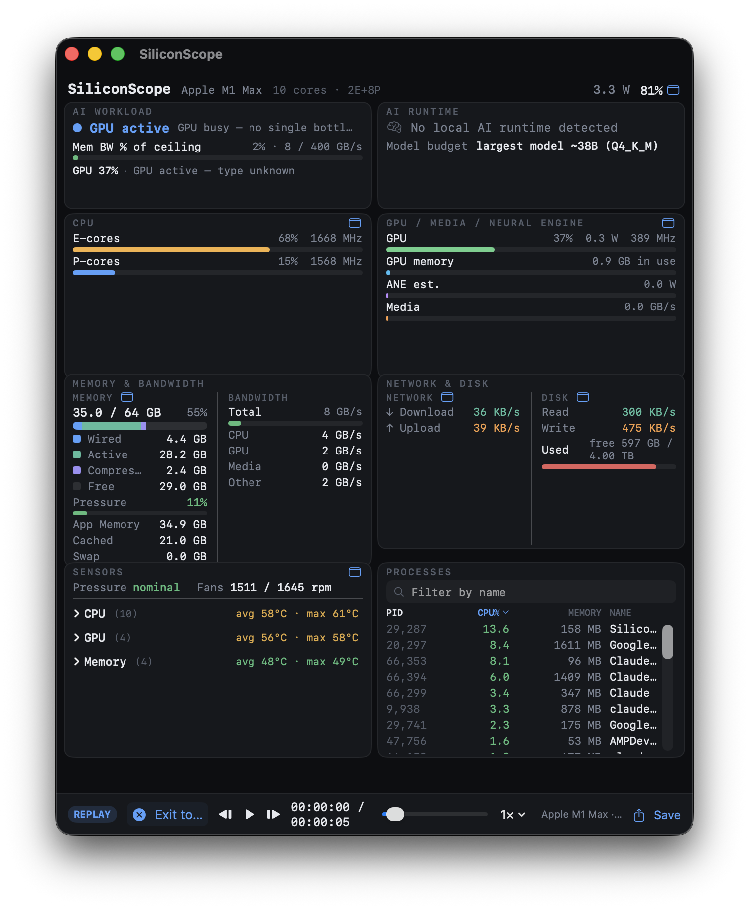
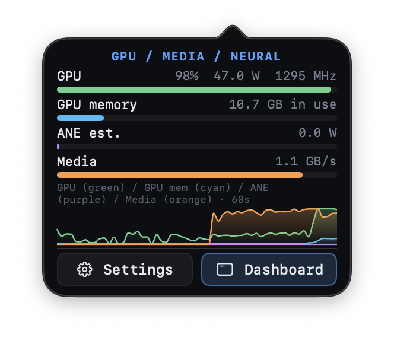
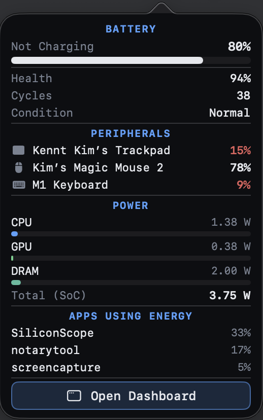
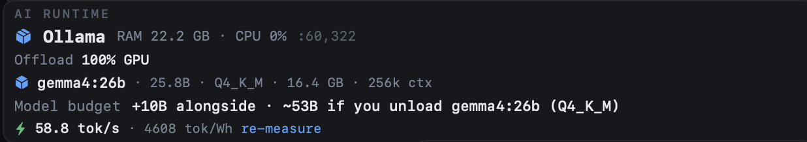

# SiliconScope

**English** · [简体中文](README.zh-CN.md) · [繁體中文](README.zh-TW.md) · [日本語](README.ja.md) · [한국어](README.ko.md)

[](https://siliconscope.calidalab.ai)
[](https://github.com/kennss/SiliconScope/releases/latest)
[](https://github.com/kennss/SiliconScope/releases)
[](LICENSE)


A **sudoless Apple Silicon system monitor** — a native SwiftUI dashboard **and** a full
menu-bar suite — with first-class **ANE (Neural Engine)**, **Media Engine**, and
**memory-bandwidth** tracking that Activity Monitor and terminal monitors don't surface.

Born from wanting to *see* how on-device AI and media workloads drive the Apple Silicon
accelerators — and grown into a daily-driver monitor that can stand in for iStat Menus.



*Under a local LLM (LM Studio · Llama-3.1-8B, 100% GPU): SiliconScope flags **thermal throttling** (GPU clock held −20% vs peak), measures the workload against the M1 Max's 400 GB/s ceiling, detects the runtime + model, and shows every engine live — GPU / GPU-memory / ANE / Media and E/P-core overlaid trends, per-core temperatures, power, and bandwidth.*

### Menu bar — every metric, iStat-style

Pin any card to its own menu-bar item — **CPU · GPU · Memory · Network · SSD · Sensors · Battery** — each with a live glyph and a rich dropdown. All sudoless.


<p align="center">
  
  
  
</p>

*Left: **GPU / Media / Neural** — GPU, GPU memory, ANE and Media as live meters plus a four-line 60-second trend. Center: per-unit temperatures — real **E-Core / P-Core / GPU / Memory** sensors (curated SMC keys per chip generation, M1–M5; HID fallback elsewhere). Right: battery health, cycle count, condition, the SoC power breakdown, and the energy-hungry apps.*



*On-demand benchmark: "Measure tok/s" runs one short generation and reports the model's decode speed and energy efficiency — **tokens/sec · tokens/Wh** — stored per model.*

> 📊 **Measured tok/s on your Mac?** [Post it in Discussions](https://github.com/kennss/SiliconScope/discussions/5) — a crowd-sourced per-chip table helps others pick the right hardware.

## Why I built it

I built SiliconScope while developing **Spectalo**, an on-device AI video player. To see how
it was actually driving the chip, I ended up running two monitors at once — and neither one
fit:

- **asitop / NeoAsitop** had the chip-level numbers, but the TUI was rough to look at and thin
  on detail.
- **btop** was gorgeous and dense, yet blind to exactly what I needed — **ANE (Neural Engine),
  the Media Engine, and memory bandwidth.**

Keeping both open side by side was painful, and a waste of screen space. I started to fork
NeoAsitop and btop to patch the gaps — then decided to do it properly instead: **one native,
good-looking GUI** that surfaces the Apple-Silicon-specific signals and that a normal person,
not just a terminal dweller, can actually read.

So I built it.

And once it existed, I realized it was finally time to part with **iStat Menus** — my daily
monitor for years. That's what **2.0** is: the release where SiliconScope grew the full
menu-bar suite, per-unit sensors, and battery health it needed to take iStat's place on my
own Mac.

## Install

**[⬇ Download the latest DMG](https://github.com/kennss/SiliconScope/releases/latest)**, then:

1. Open the downloaded `SiliconScope-*.dmg`
2. Drag **SiliconScope** into **Applications**
3. Launch it

Signed with a Developer ID and **notarized by Apple** — it opens with no Gatekeeper
prompt. Requires **macOS 14+ on Apple Silicon**. It **updates itself** from here on
(Sparkle) — this is the last DMG you download by hand.

Prefer to build it yourself? See [Build & run](#build--run).

## Highlights

- **AI Workload view** — a bottleneck classifier (*bandwidth-bound* / *compute-bound* /
  *thermal-throttled* / *memory-pressured*) with a per-chip **"% of ceiling"** bandwidth
  gauge — answers "what's limiting my local LLM right now?"
- **E-core / P-core split** — per-cluster utilization + real DVFS frequency
- **GPU** — utilization, power, frequency
- **ANE & Media Engine** — Neural-Engine power and media-codec bandwidth (the differentiators)
- **Memory bandwidth** — CPU / GPU / Media / total GB/s (the local-LLM bottleneck signal)
- **Memory** — Wired / Active / Compressed / Free stacked bar + macOS **memory-pressure** alerts
- **Network** ↑/↓ and **Disk** read/write + free space, with live graphs
- **Per-unit temperatures** — real **E-Core / P-Core / GPU / Memory** sensors via curated
  per-generation SMC keys (M1–M5; HID fallback on others), fan RPM, thermal pressure, and
  **GPU throttle detection** (clock held below its rolling peak under pressure)
- **Battery** — charge state, **health %, cycle count, condition** (AppleSmartBattery)
- **Power** — per-domain CPU / GPU / ANE / DRAM / SoC, plus battery
- **Processes** — sort, filter, kill (in-card scroll)
- **Per-metric menu-bar items** — pin CPU / GPU / Memory / Network / SSD / Sensors / Battery
  each to its own menu-bar glyph + dropdown (plus the combined "SS" cockpit glyph)
- **Auto-update** — built-in Sparkle updater; "Check for Updates…" in the menu
- **No `sudo` required.**

## Build & run

Requires macOS on Apple Silicon and the Xcode toolchain.

```bash
xcrun swift run SiliconScope        # SwiftUI GUI (dashboard + menu bar)
xcrun swift run -q sscope-cli       # data-layer verification CLI
xcrun swift build                   # build everything
scripts/build-app.sh                # create dist/SiliconScope.app locally
open dist/SiliconScope.app          # launch the local app bundle
```

> Use `xcrun`. A non-Xcode `swift` (e.g. swiftly) may not match the macOS SDK and
> will fail with `Failed to build module 'Foundation'`.

## How it works (all sudoless)

| Data | Source |
|---|---|
| Power (CPU/GPU/ANE/DRAM), residency, memory bandwidth | private **IOReport** framework (symbols resolved at runtime via dyld) |
| CPU usage | `host_processor_info` ticks (matches Activity Monitor) |
| CPU/GPU frequency | IOReport `CPU Stats` / `GPU Stats` × IORegistry DVFS table |
| Memory / swap / pressure | `host_statistics64`, `sysctl` |
| Temperatures (per-unit) | curated per-generation **SMC** FourCC keys + **HID** (`IOHIDEventSystem`) fallback |
| Fans, thermal pressure | **SMC** via IOKit |
| Network / Disk | `getifaddrs` / SystemConfiguration, mounted-volume capacities |
| Battery (charge + health/cycles/condition) | IOPowerSources + **AppleSmartBattery** (IORegistry) |
| Processes | `libproc` |

Verified IOReport channel map: [`docs/ioreport-channels.md`](docs/ioreport-channels.md).
Display spec: [`docs/display-spec.md`](docs/display-spec.md).

### Deep dive — the hard parts

Most of these are private/undocumented APIs with no SDK stub. The patterns below are the
reason people clone this repo — each one is a gotcha that cost a day to figure out.

#### 1. IOReport without `sudo` — and without an SDK stub

`IOReport` carries the good stuff (per-domain power, cluster residency, memory bandwidth) and
needs **no root**. The catch: there's no `.tbd` stub in the SDK, so `-framework IOReport`
fails to link. The fix is to **declare the symbols yourself** and let dyld resolve them from
the shared cache at runtime:

```swift
// Package.swift — link the final binary with dynamic_lookup
linkerSettings: [.unsafeFlags(["-Xlinker", "-undefined", "-Xlinker", "dynamic_lookup"])]
```
```c
// Sources/CIOReport/include/ktop_ioreport.h — your own extern decls (one isolated C target)
extern CFDictionaryRef IOReportCreateSamples(IOReportSubscriptionRef, CFMutableDictionaryRef, CFTypeRef);
extern CFDictionaryRef IOReportCreateSamplesDelta(CFDictionaryRef prev, CFDictionaryRef cur, CFTypeRef);
```

Sampling is **two snapshots a short interval apart (~175 ms), then `…SamplesDelta`** — power
and residency are deltas, not instantaneous values. All private declarations live in one C
target (`CIOReport`) so the unsafe surface is contained and the Swift side stays clean.

> Trade-off: private API ⇒ **no App Store sandbox**. Self-distribute (sign + notarize). The
> `dynamic_lookup` flag is broad — it defers *all* undefined symbols to runtime, so a real
> link typo only surfaces on launch. Worth knowing.

#### 2. Per-unit temperatures: curated SMC keys, HID fallback

On Apple Silicon a naive SMC "scan all `T…` keys" returns almost nothing useful, and the HID
sensor set (`IOHIDEventSystemClient`, `PrimaryUsagePage 0xff00` / usage `5`) returns *many*
sensors but with cryptic PMU names (`PMU tdie3`, `tcal`). iStat-style friendly names come from
a **hand-curated, per-generation map of SMC FourCC keys read directly** (not scanned):

```swift
// SensorCatalog.swift — detected from the CPU brand string (M1…M5)
cpu([("Tp09","E-Core 1"), ("Tp01","P-Core 1"), ("Tp05","P-Core 2"), …]) +
gpu([("Tg05","GPU 1"), …]) + mem([("Tm02","Memory 1"), …])
```

The keys are near-arbitrary and change every generation (tables adapted from
[Stats](https://github.com/exelban/stats)). Fallback chain: **curated SMC → HID set → SMC
scan** (Intel). Variants (Pro/Max/Ultra) need no special-casing — absent keys simply don't
read back and are skipped.

#### 3. E/P-core split + real DVFS frequency

Topology from `sysctl hw.perflevel0/1`; per-core utilization from `host_processor_info` ticks
(the same source Activity Monitor uses). Frequency is residency-weighted: IOReport gives time
spent in each DVFS state, and the **state→MHz table comes from IORegistry** (`voltage-states*`),
so the reported MHz is what the cluster actually ran at, not a nominal max.

#### 4. ANE & memory bandwidth (with an honest caveat)

The IOReport **Energy Model** group exposes per-domain power including the Neural Engine, and
the bandwidth channels give CPU/GPU/Media/total GB/s. **ANE "usage" is a power-normalized
estimate** — Apple doesn't expose ANE occupancy, so it's labeled as an estimate rather than
faked as a percentage.

#### 5. Dynamic per-metric menu-bar items (AppKit, not SwiftUI)

Each metric becomes its own menu-bar item you can toggle. SwiftUI's `MenuBarExtra` can't do
this: a conditional scene won't compile (SceneBuilder has no `buildOptional`), and
`MenuBarExtra(isInserted:)` triggers a main-menu update **loop** (beachball). The working
answer is AppKit — an `NSStatusItem` + `NSPopover` per enabled metric, reconciled against the
toggles each tick. Live glyphs are drawn to `NSImage` (a live SwiftUI `label:` collapses to
zero width in a status item).

#### 6. Auto-update in a pure-SPM app

Sparkle via SPM, with **no Xcode project**: `package.sh` embeds `Sparkle.framework`, fixes the
rpath, signs nested helpers deep→shallow, then runs `generate_appcast`. The feed is the
**latest GitHub release's `appcast.xml`** (`…/releases/latest/download/appcast.xml`), so each
release just attaches the DMG + appcast and the app updates itself.

## Not on the Mac App Store

SiliconScope uses private (un-entitled) APIs (IOReport, SMC, HID), so it cannot be
sandboxed/notarized for the App Store. Distribute directly. This is the same
trade-off as NeoAsitop, macmon, mactop, and Stats.

## Contributing

PRs welcome — see [CONTRIBUTING.md](CONTRIBUTING.md). The most useful contribution right now:
**verify the per-chip temperature keys.** The M1 table is hardware-validated; **M2–M5 are
adapted but unverified**. On an M2/M3/M4/M5, run `xcrun swift run -q sscope-cli --sensors`
(+ `sysctl hw.model machdep.cpu.brand_string`) and open an issue with the output.

## Acknowledgements

- IOReport / SMC / HID sensor knowledge referenced from **NeoAsitop** (MIT) and
  **SocPowerBuddy**; the per-generation SMC temperature key→name tables are adapted from
  **[Stats](https://github.com/exelban/stats)** (MIT). The data layer is written from
  scratch — declarations/facts referenced, no code copied.
- Auto-update by **[Sparkle](https://sparkle-project.org)**.
- Design language inspired by **btop**.

## License

MIT © 2026 Kennt Kim — see [LICENSE](LICENSE).
